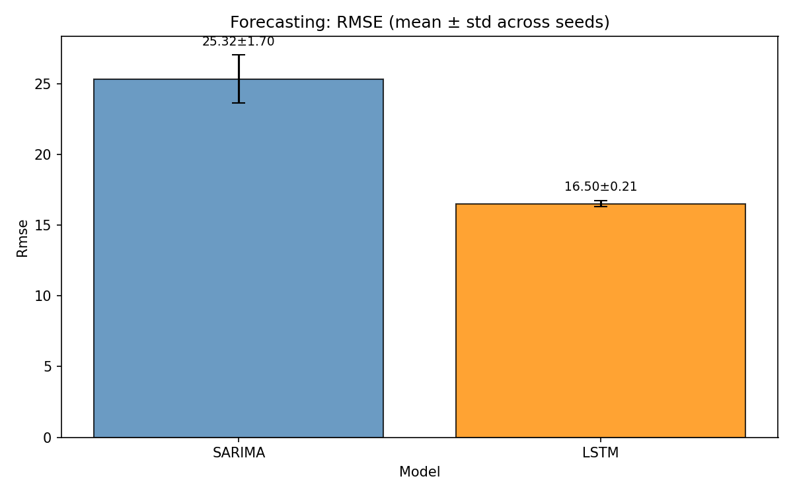
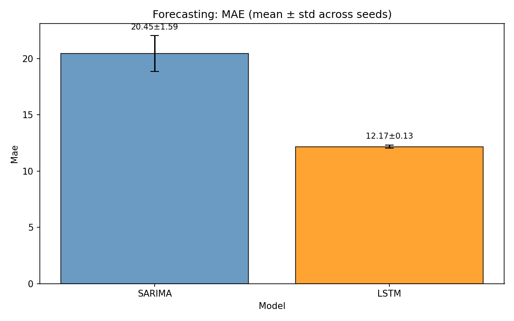
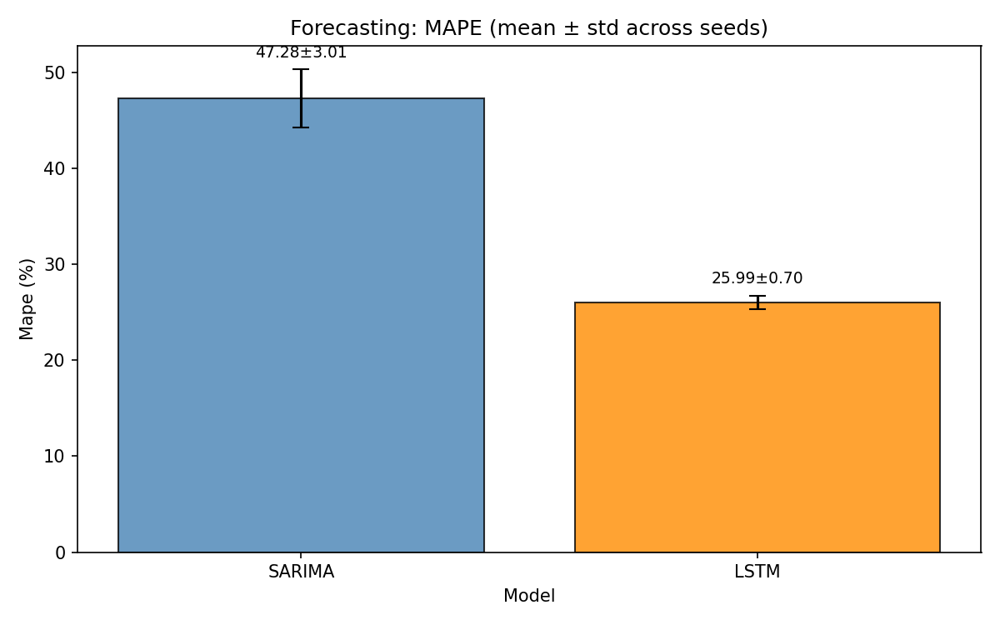
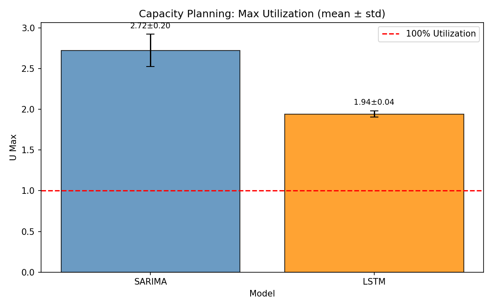
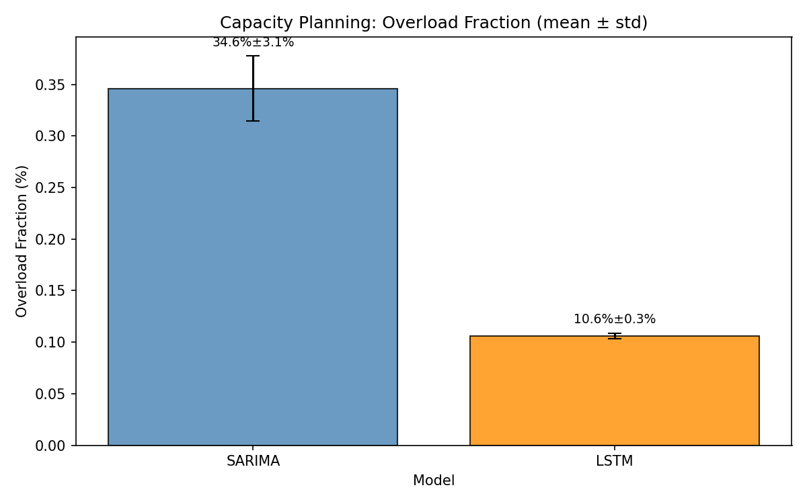
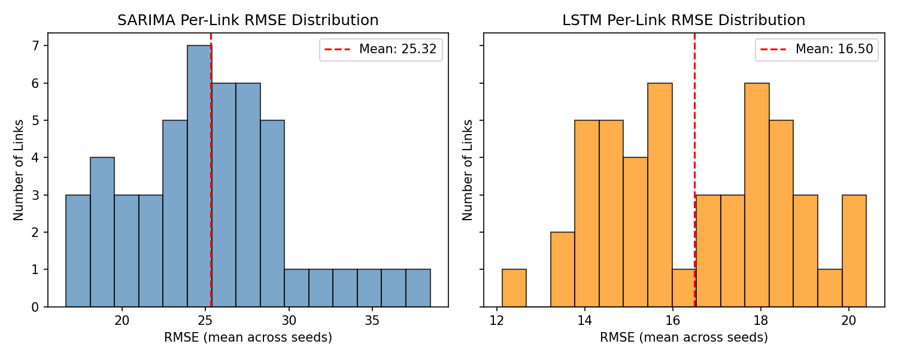
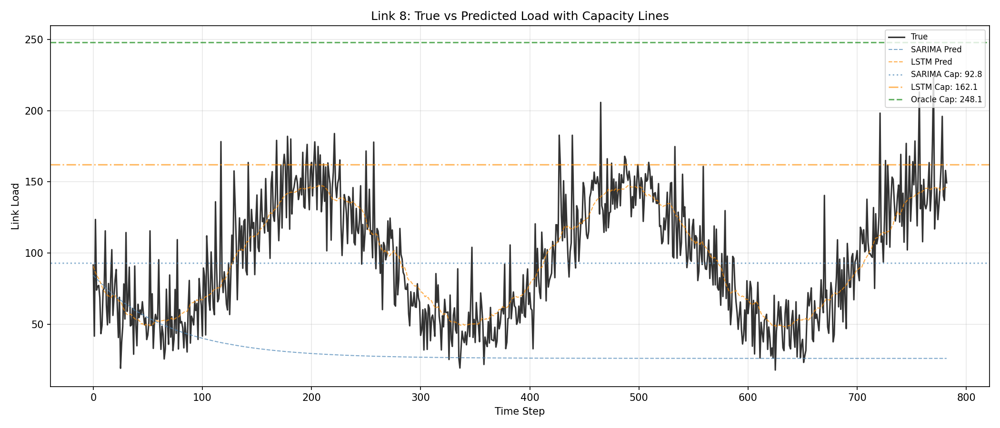
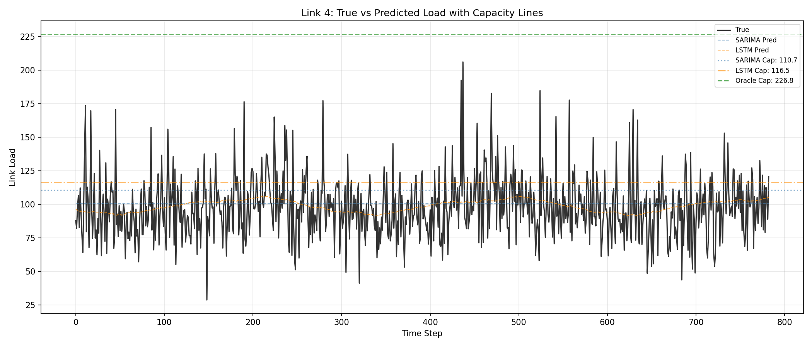

# Network Traffic Forecasting & Capacity Planning

Compare SARIMA vs LSTM models for link load prediction in a synthetic backbone network, and evaluate how forecasting quality affects capacity planning decisions.

## Overview

This project implements a complete simulation pipeline to:
1. Generate synthetic network traffic on a 12-node backbone topology
2. Train SARIMA (per-link) and LSTM (joint) forecasting models
3. Evaluate forecasting accuracy (RMSE, MAE, MAPE)
4. Analyze capacity planning implications (utilization, overload rates)

## Quick Start

```bash
# Create virtual environment
python3 -m venv venv
source venv/bin/activate

# Install dependencies
pip install -r requirements.txt

# Run full pipeline (single seed)
python scripts/main.py

# Or run multi-seed experiments for robust results
python scripts/run_experiments.py
```

## Project Structure

```
├── src/                # Core modules
│   ├── config.py       # Global configuration parameters
│   ├── utils.py        # Shared utility functions
│   ├── simulate_data.py    # Synthetic data generation
│   ├── train_arima.py      # SARIMA model training
│   ├── train_lstm.py       # LSTM model training
│   └── eval_capacity.py    # Evaluation and capacity planning
├── scripts/
│   ├── main.py             # Pipeline orchestrator
│   └── run_experiments.py  # Multi-seed experiment runner
├── tests/              # Test suite
├── requirements.txt    # Python dependencies
├── data/               # Generated data files
├── models/             # Trained model artifacts
├── results/            # Metrics and predictions
├── plots/              # Visualization outputs
└── report/             # Academic paper (LaTeX)
```

## Configuration

Key parameters in `src/config.py`:

| Parameter | Value | Description |
|-----------|-------|-------------|
| `num_nodes` | 12 | Network nodes |
| `days` | 14 | Simulation duration |
| `time_step_minutes` | 5 | Sampling interval |
| `window_size` | 72 | LSTM input window (6 hours) |
| `arima_order` | (2,1,2) | ARIMA order |
| `seasonal_order` | (1,0,1,72) | SARIMA seasonal (6-hour period) |
| `capacity_margin` | 1.1 | 10% safety margin |
| Random seeds | 42, 123, 456, 789, 1024 | For multi-seed experiments |

## Results

Results from multi-seed experiments (n=5 seeds: 42, 123, 456, 789, 1024) showing mean ± std.

### Forecasting Metrics

| Model | RMSE | MAE | MAPE |
|-------|------|-----|------|
| SARIMA | 25.32 ± 1.70 | 20.45 ± 1.59 | 47.3% ± 3.0% |
| LSTM | **16.50 ± 0.21** | **12.17 ± 0.13** | **26.0% ± 0.7%** |

| RMSE (mean ± std) | MAE (mean ± std) | MAPE (mean ± std) |
|:-----------------:|:----------------:|:-----------------:|
|  |  |  |

### Capacity Planning

| Model | Mean U_max | Overload Rate |
|-------|------------|---------------|
| SARIMA | 2.72 ± 0.20 | 34.6% ± 3.2% |
| LSTM | **1.94 ± 0.04** | **10.6% ± 0.3%** |

| Max Utilization (mean ± std) | Overload Rate (mean ± std) |
|:----------------------------:|:--------------------------:|
|  |  |

**Key Findings**:
- LSTM achieves **35% lower RMSE** than SARIMA (16.5 vs 25.3)
- LSTM shows **45% lower MAPE** (26% vs 47%)
- LSTM reduces overload rate by **69%** (10.6% vs 34.6%)
- LSTM exhibits much lower variance across seeds, indicating more stable training

### Per-Link RMSE Distribution



### Time Series Examples

| LSTM Wins | SARIMA Wins |
|:---------:|:-----------:|
|  |  |

## Usage Options

```bash
# Full pipeline (single seed)
python scripts/main.py

# Skip data generation (reuse existing)
python scripts/main.py --skip-data

# Only run evaluation
python scripts/main.py --eval-only

# Multi-seed experiments (recommended)
python scripts/run_experiments.py --seeds 42 123 456 789 1024

# Run individual modules
python -m src.simulate_data
python -m src.train_arima
python -m src.train_lstm
python -m src.eval_capacity
```

## Generated Outputs

- **Data**: `data/topology.npz`, `data/traffic_data.npz`
- **Model**: `models/lstm_forecaster.pt`
- **Metrics**: `results/combined_results.json`, `results/aggregated_results.json`
- **Per-seed**: `results/seed_*/` (individual seed results)
- **Plots**: `plots/*.png` (histograms, comparisons, time series)

## Report

A detailed academic report is available: **[paper.pdf](report/paper.pdf)** (IEEE format)

It includes:

- Literature survey of ML approaches for traffic prediction
- Detailed methodology and mathematical formulation
- Extended discussion of results and limitations

LaTeX source: [`report/paper.tex`](report/paper.tex)

## Requirements

- Python 3.9+
- numpy, pandas, networkx
- matplotlib, statsmodels
- torch, scikit-learn, joblib
